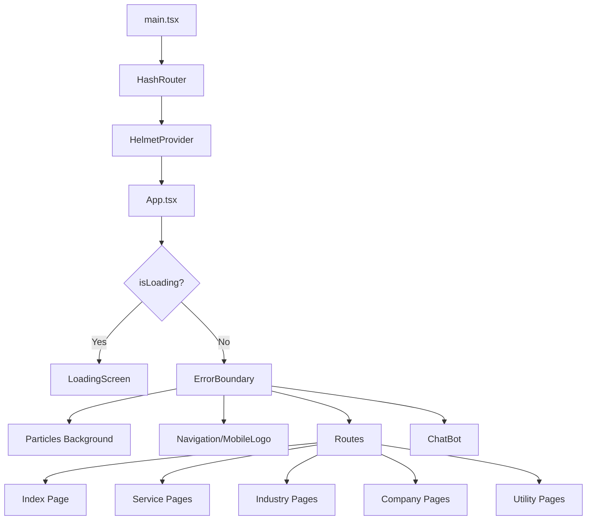

# HyvenTech - Complete Product Specification

**Project Name:** HyvenTech (Fusion Innovation IT)  
**Version:** 1.0.0  
**Last Updated:** November 27, 2025  
**Type:** Single Page Application (SPA) + Multi-Page Corporate Website

---

## Table of Contents

1. [Executive Summary](#executive-summary)
2. [Technology Stack](#technology-stack)
3. [Project Architecture](#project-architecture)
4. [Design System](#design-system)
5. [Components Specification](#components-specification)
6. [Pages Specification](#pages-specification)
7. [Routing Logic](#routing-logic)
8. [Animation & Transitions](#animation--transitions)
9. [Content & Text](#content--text)
10. [Interactive Features](#interactive-features)
11. [Deployment Configuration](#deployment-configuration)

---

## 1. Executive Summary

### Business Overview

HyvenTech is an innovative technology company specializing in integrated solutions across multiple sectors including Healthcare, Finance, Manufacturing, Logistics, Education, Energy, and Retail. The company focuses on four core service pillars:

1. AI Solutions
2. Cyber Security Solutions
3. Medical Software Solutions
4. Social Media Solutions

### Website Purpose

A premium corporate website designed to showcase HyvenTech's services, expertise, and team while providing an engaging user experience through modern web technologies and stunning visual effects.

### Target Audience

- Enterprise clients in Healthcare, Finance, Manufacturing, and other key sectors
- Decision-makers looking for AI-powered systems and custom software solutions
- Businesses seeking digital transformation partners

---

## 2. Technology Stack

### Core Framework

- **React:** 18.3.1 - UI library
- **TypeScript:** 5.8.3 - Type-safe development
- **Vite:** 7.2.4 - Build tool and dev server

### Routing

- **React Router DOM:** 7.1.1 - Client-side routing
- **HashRouter:** Used for GitHub Pages compatibility
- **Base Path:** `/Fusion-Innovation-IT/`

### Styling

- **Tailwind CSS:** 3.4.17 - Utility-first CSS framework
- **tailwindcss-animate:** 1.0.7 - Animation utilities
- **PostCSS:** 8.5.6 - CSS processing
- **Autoprefixer:** 10.4.21 - Vendor prefixes

### Animation

- **Framer Motion:** 11.15.0 - React animation library
- **GSAP:** 3.13.0 - Advanced animations (optional)
- **OGL:** 1.0.11 - WebGL particle system

### UI Components

- **Radix UI:** Component primitives
  - `@radix-ui/react-accordion`: 1.2.11
  - `@radix-ui/react-slot`: 1.2.3
  - `@radix-ui/react-toast`: 1.2.14
  - `@radix-ui/react-tooltip`: 1.2.7
- **Lucide React:** 0.468.0 - Icon library
- **Sonner:** 2.0.7 - Toast notifications

### Form Handling

- **React Hook Form:** 7.54.2 - Form state management

### SEO

- **React Helmet Async:** 2.0.5 - Document head management

### Utilities

- **class-variance-authority:** 0.7.1 - CSS variant API
- **clsx:** 2.1.1 - Conditional classnames
- **tailwind-merge:** 2.6.0 - Tailwind class merging

---

## 3. Project Architecture

### Folder Structure

```
HyvenTech/
├── public/                          # Static assets
├── src/
│   ├── App.tsx                      # Root application component
│   ├── main.tsx                     # Application entry point
│   ├── index.css                    # Global styles
│   ├── components/                  # Reusable components
│   │   ├── About.tsx
│   │   ├── BackToTop.tsx
│   │   ├── BottomNavigation.tsx
│   │   ├── ChatBot.tsx
│   │   ├── ClientLogos.tsx
│   │   ├── Contact.tsx
│   │   ├── ErrorBoundary.tsx
│   │   ├── Footer.tsx
│   │   ├── Hero.tsx
│   │   ├── Industries.tsx
│   │   ├── IndustryDetail.tsx
│   │   ├── LoadingScreen.tsx
│   │   ├── MobileLogo.tsx
│   │   ├── NavLink.tsx
│   │   ├── Navigation.tsx
│   │   ├── Process.tsx
│   │   ├── SEO.tsx
│   │   ├── ScrollToTop.tsx
│   │   ├── ServiceDetail.tsx
│   │   ├── Services.tsx
│   │   ├── Team.tsx
│   │   ├── WhyChooseUs.tsx
│   │   └── ui/                      # Shadcn UI components
│   │       ├── Particles.tsx        # 3D WebGL particles
│   │       ├── accordion.tsx
│   │       ├── button.tsx
│   │       ├── card.tsx
│   │       ├── input.tsx
│   │       ├── sonner.tsx
│   │       ├── textarea.tsx
│   │       ├── toast.tsx
│   │       ├── toaster.tsx
│   │       └── tooltip.tsx
│   ├── pages/                       # Page components
│   │   ├── Index.tsx                # Landing page
│   │   ├── Careers.tsx
│   │   ├── ComingSoon.tsx
│   │   ├── FAQ.tsx
│   │   ├── NotFound.tsx
│   │   ├── PrivacyPolicy.tsx
│   │   ├── SocialMedia.tsx
│   │   ├── TermsOfService.tsx
│   │   ├── company/                 # Company pages
│   │   │   ├── AboutUsDetailed.tsx
│   │   │   ├── HyvenLeadership.tsx
│   │   │   ├── Methodology.tsx
│   │   │   └── WhyUs.tsx
│   │   ├── industries/              # Industry-specific pages
│   │   │   ├── Education.tsx
│   │   │   ├── Energy.tsx
│   │   │   ├── Finance.tsx
│   │   │   ├── Healthcare.tsx
│   │   │   ├── Logistics.tsx
│   │   │   ├── Manufacturing.tsx
│   │   │   └── Retail.tsx
│   │   └── services/                # Service detail pages
│   │       ├── AccountingSystems.tsx
│   │       ├── AIServices.tsx
│   │       ├── CyberSecurity.tsx
│   │       ├── DigitalDevelopment.tsx
│   │       ├── SocialMedia.tsx
│   │       └── TechnicalHardware.tsx
│   ├── hooks/                       # Custom React hooks
│   │   ├── use-mobile.tsx
│   │   └── use-toast.ts
│   └── lib/                         # Utility functions
│       └── utils.ts
├── tailwind.config.ts               # Tailwind configuration
├── vite.config.ts                   # Vite configuration
└── package.json                     # Dependencies
```

### Application Flow



---

## 4. Design System

### Color Scheme

#### Primary Theme

**Dark Mode Design** - Blue background with off-white text for premium, professional aesthetic

```css
/* Core Colors */
--background: 212 73% 18%        /* Deep Blue #0C2B4E */
--foreground: 0 0% 96%           /* Off-white #f4f4f4 */

--primary: 0 0% 96%              /* Off-white (for highlights) */
--primary-foreground: 212 73% 18%  /* Deep Blue */

--secondary: 212 30% 25%         /* Darker secondary */
--muted: 212 30% 25%
--accent: 212 30% 25%

/* Borders & Inputs */
--border: 212 30% 25%
--input: 212 30% 25%
--ring: 0 0% 96%

/* Destructive */
--destructive: 0 62% 30%
```

#### Gradient Tokens

```css
--gradient-primary: linear-gradient(135deg, hsl(0 0% 96%) 0%, hsl(212 20% 80%) 100%)
--gradient-glow: linear-gradient(135deg, hsl(0 0% 96% / 0.15) 0%, hsl(0 0% 96% / 0.05) 100%)
```

#### Glow Effects

```css
--glow-primary: 0 0 40px hsl(0 0% 96% / 0.3)
--glow-strong: 0 0 60px hsl(0 0% 96% / 0.5)
```

#### Glassmorphism

```css
--glass-bg: hsl(212 73% 18% / 0.8)
--glass-border: hsl(0 0% 96% / 0.15)
```

### Typography

- **Font Smoothing:** -webkit-font-smoothing: antialiased
- **Scale:**
  - Headings: 2xl - 7xl (responsive)
  - Body: sm - lg (responsive)
  - Small text: xs - sm

### Spacing & Layout

- **Container Padding:**
  - Default: 1rem
  - sm: 1.5rem
  - lg: 2rem
- **Breakpoints:**
  - sm: 640px
  - md: 768px
  - lg: 1024px
  - xl: 1280px
  - 2xl: 1400px

### Border Radius

```css
--radius: 1rem
lg: var(--radius)
md: calc(var(--radius) - 2px)
sm: calc(var(--radius) - 4px)
```

### Utility Classes

#### Glassmorphism Effect

```css
.glass {
  background: var(--glass-bg);
  backdrop-filter: blur(12px);
  -webkit-backdrop-filter: blur(12px);
  border: 1px solid var(--glass-border);
}
```

#### Glow Effects

```css
.glow {
  box-shadow: var(--glow-primary);
}

.glow-strong {
  box-shadow: var(--glow-strong);
}
```

#### Gradient Backgrounds

```css
.bg-gradient-primary {
  background: var(--gradient-primary);
}

.bg-gradient-glow {
  background: var(--gradient-glow);
}
```

### Scroll Behavior

```css
html {
  scroll-behavior: smooth;
  scroll-padding-top: 3.5rem; /* Mobile */
}

@media (min-width: 640px) {
  scroll-padding-top: 4rem; /* sm */
}

@media (min-width: 768px) {
  scroll-padding-top: 4.5rem; /* md */
}

@media (min-width: 1024px) {
  scroll-padding-top: 5rem; /* lg+ */
}
```

---

## 5. Components Specification

### 5.1 Particles (3D Background)

**File:** `src/components/ui/Particles.tsx`

**Technology:** OGL (WebGL)

**Configuration:**

```typescript
{
  particleColors: ['#06B6D4', '#3B82F6', '#ffffff'],  // Cyan, Blue, White
  particleCount: 300,
  particleSpread: 12,
  speed: 0.05,                      // Slow, ambient movement
  particleBaseSize: 100,
  moveParticlesOnHover: true,
  particleHoverFactor: 1.5,
  alphaParticles: true,             // Transparent particles
  sizeRandomness: 1.2,
  cameraDistance: 20,
  disableRotation: false
}
```

**Rendering Logic:**

- GLSL vertex/fragment shaders for particle rendering
- Continuous rotation and movement
- Mouse interaction for hover effects
- Automatic resize handling
- Performance optimized with WebGL

**Visual Effect:**

- Cyber/Tech Innovation theme
- 3D depth with camera perspective
- Smooth, organic particle movement
- Interactive hover response

---

### 5.2 LoadingScreen

**File:** `src/components/LoadingScreen.tsx`

**Purpose:** Initial page load experience

**Behavior:**

1. Types out "HyvenTech" character by character (100ms intervals)
2. Displays animated cursor after text
3. Waits 1 second after completion
4. Triggers `onComplete` callback to hide loader

**Styling:**

- Fixed fullscreen overlay
- Z-index: 50
- Background: --background
- Text: 4xl (mobile) to 6xl (desktop)
- Color: --primary
- Cursor: Pulsing opacity animation

**Total Duration:** ~3.5 seconds (900ms typing + 1000ms delay)

---

### 5.3 Navigation

**File:** `src/components/Navigation.tsx`

**Type:** Desktop Navigation Bar (hidden on mobile)

**Features:**

- Fixed positioning with scroll-based visibility
- Logo with gradient glow effect
- Dropdown menus for Services, Key Sectors, and Company
- Active state tracking
- Smooth scroll to sections
- HashRouter link handling

**Navigation Items:**

```javascript
[
  { name: "Home", href: "/" },
  {
    name: "Services",
    href: "/services",
    dropdown: [
      { name: "Accounting Systems", href: "/services/accounting-systems" },
      { name: "Digital Development", href: "/services/digital-development" },
      { name: "AI Solutions", href: "/services/ai-solutions" },
      { name: "Technical Hardware", href: "/services/technical-hardware" },
      { name: "Digital Marketing", href: "/services/digital-marketing" },
      { name: "Cyber Security", href: "/services/cyber-security" },
    ],
  },
  {
    name: "Key Sectors",
    href: "/key-sectors",
    dropdown: [
      { name: "Healthcare", href: "/key-sectors/healthcare" },
      { name: "Finance & Banking", href: "/key-sectors/finance" },
      { name: "Retail & E-Commerce", href: "/key-sectors/retail" },
      { name: "Manufacturing", href: "/key-sectors/manufacturing" },
      { name: "Education", href: "/key-sectors/education" },
      { name: "Logistics", href: "/key-sectors/logistics" },
      { name: "Energy & Utilities", href: "/key-sectors/energy" },
    ],
  },
  {
    name: "Company",
    href: "/about",
    dropdown: [
      { name: "About HyvenTech", href: "/company/profile", isHighlight: true },
      { name: "Leadership", href: "/company/leadership" },
      { name: "Our Methodology", href: "/company/methodology" },
      { name: "The HyvenTech Advantage", href: "/company/why-us" },
    ],
  },
  { name: "Contact", href: "/contact" },
];
```

**Scroll Behavior:**

- Tracks scroll position via Framer Motion's `useScroll`
- Shows/hides based on scroll direction
- Glassmorphism background with backdrop blur

**Dropdown Logic:**

- Click to open/close
- Click outside to close
- Animated appearance with Framer Motion
- Highlight effect for featured items

---

### 5.4 MobileLogo

**File:** `src/components/MobileLogo.tsx`

**Purpose:** Top-left logo display for mobile devices

**Styling:**

- Fixed position at top-left
- Gradient background with glow effect
- "HT" initials in primary color

---

### 5.5 BottomNavigation

**File:** `src/components/BottomNavigation.tsx`

**Purpose:** Mobile navigation menu

**Features:**

- Fixed bottom position
- Icon-based navigation
- Active state indication
- Glassmorphism styling

**Navigation Items:**

- Home
- Services
- About
- Contact

---

### 5.6 Hero

**File:** `src/components/Hero.tsx`

**Layout:** Centered, full-screen section

**Content:**

- **Main Headline:**  
  "Custom Software Solutions for Enterprise Digital Transformation"
- **Sub-headline:**  
  "We build AI-powered systems, secure cloud infrastructure, and custom applications that scale with your business"
- **Key Benefits:**
  - Enterprise-Grade Security
  - Scalable Architecture
  - 24/7 Support
- **CTA Buttons:**
  1. "View Our Services" - Primary button with glow
  2. "Get Started" - Outline button
- **Trust Indicator:**  
  "Trusted by industry leaders across healthcare, finance, and manufacturing"

**Styling:**

- Centered layout with max-width: 5xl
- Gradient background blur effect
- Animated appearance with staggered delays
- Responsive typography

**Interactions:**

- "View Our Services" scrolls to #services
- "Get Started" scrolls to #contact
- Hover effects on buttons with icon rotation

**Animations:**

```javascript
{
  initial: { opacity: 0, y: 20 },
  animate: { opacity: 1, y: 0 },
  transition: { delay: 0.2-0.8, duration: 0.8 }
}
```

---

### 5.7 ClientLogos

**File:** `src/components/ClientLogos.tsx`

**Purpose:** Display partner/client logos

**Partners:**

- KnowBe4 (Cybersecurity)
- [Other partners as configured]

**Layout:** Horizontal scrolling carousel

**Styling:**

- Glassmorphism cards
- Grayscale to color on hover
- Smooth transitions

---

### 5.8 Services

**File:** `src/components/Services.tsx`

**Section Title:**  
"Core Capabilities"

**Services Array:**

```javascript
[
  {
    icon: Calculator,
    title: "Accounting Systems",
    description:
      "Our own ready-to-use software, as well as fully customized systems tailored to your specific requirements.",
    link: "/services/accounting-systems",
  },
  {
    icon: Code,
    title: "Digital Development",
    description: "Professional website and mobile application development.",
    link: "/services/digital-development",
  },
  {
    icon: Bot,
    title: "Artificial Intelligence (AI)",
    description:
      "Smart solutions and software designed to meet current market demands.",
    link: "/services/ai-solutions",
  },
  {
    icon: HardDrive,
    title: "Technical Hardware",
    description:
      "Supply of hardware specifically for accounting systems (e.g., barcode scanners and POS terminals).",
    link: "/services/technical-hardware",
  },
  {
    icon: Share2,
    title: "Digital Marketing",
    description:
      "Integrated solutions for managing and delivering social media services.",
    link: "/services/digital-marketing",
  },
  {
    icon: ShieldCheck,
    title: "Cyber Security",
    description: "Strategic partnership with KnowBe4.",
    link: "/services/cyber-security",
  },
];
```

**Card Layout:**

- 3-column grid (desktop), 2-column (tablet), 1-column (mobile)
- Glassmorphism cards with glow effect
- Animated icon in gradient circle
- Two buttons per card:
  1. "Get Consultation" - Scrolls to contact
  2. "Learn More" - Navigate to detail page

**Animations:**

- Staggered entrance (0.1s delay per card)
- Pulsing glow effect on mobile (infinite loop)
- Icon scale on hover
- Card lift on hover (-2px translate-y)

---

### 5.9 Industries

**File:** `src/components/Industries.tsx`

**Section Title:**  
"Key Sectors"

**Industries Array:**

```javascript
[
  {
    icon: Heart,
    name: "Healthcare",
    description:
      "HIPAA-compliant solutions for hospitals, clinics, and healthcare providers",
    solutions: ["EMR Systems", "Patient Portals", "Telemedicine"],
    link: "/key-sectors/healthcare",
  },
  {
    icon: DollarSign,
    name: "Finance & Banking",
    description:
      "Secure, scalable fintech solutions with regulatory compliance",
    solutions: ["Payment Systems", "Trading Platforms", "Risk Management"],
    link: "/key-sectors/finance",
  },
  {
    icon: ShoppingCart,
    name: "Retail & E-Commerce",
    description: "Omnichannel retail solutions driving customer engagement",
    solutions: ["E-Commerce Platforms", "POS Systems", "Inventory Management"],
    link: "/key-sectors/retail",
  },
  {
    icon: Factory,
    name: "Manufacturing",
    description:
      "Industry 4.0 solutions for smart manufacturing and supply chain",
    solutions: ["MES Systems", "IoT Monitoring", "Predictive Maintenance"],
    link: "/key-sectors/manufacturing",
  },
  {
    icon: GraduationCap,
    name: "Education",
    description: "EdTech platforms enhancing learning experiences",
    solutions: ["LMS Platforms", "Student Portals", "Virtual Classrooms"],
    link: "/key-sectors/education",
  },
  {
    icon: Truck,
    name: "Logistics",
    description: "Supply chain optimization and fleet management solutions",
    solutions: [
      "Route Optimization",
      "Warehouse Management",
      "Tracking Systems",
    ],
    link: "/key-sectors/logistics",
  },
  {
    icon: Leaf,
    name: "Energy & Utilities",
    description: "Smart grid and renewable energy management systems",
    solutions: ["Smart Metering", "Energy Analytics", "Grid Management"],
    link: "/key-sectors/energy",
  },
];
```

**Card Features:**

- 4-column grid (desktop)
- Icon with gradient background
- Solution list with bullet points
- Rocket icon link to detail page (bottom-right)

**Styling:**

- Background: muted/20
- Glass effect cards
- Hover: glow-strong effect

---

### 5.10 Process

**File:** `src/components/Process.tsx`

**Section Title:**  
"Our Methodology"

**Process Steps:**

```javascript
[
  {
    icon: Search,
    title: "Discovery & Analysis",
    description:
      "We dive deep into your business needs, challenges, and goals to create a comprehensive project roadmap.",
    duration: "1-2 weeks",
  },
  {
    icon: FileText,
    title: "Planning & Design",
    description:
      "Detailed technical specifications, architecture design, and project timeline with clear milestones.",
    duration: "2-3 weeks",
  },
  {
    icon: Code,
    title: "Development",
    description:
      "Agile development with regular sprints, continuous integration, and transparent progress tracking.",
    duration: "8-16 weeks",
  },
  {
    icon: TestTube,
    title: "Testing & QA",
    description:
      "Rigorous testing including unit, integration, and user acceptance testing to ensure quality.",
    duration: "2-4 weeks",
  },
  {
    icon: Rocket,
    title: "Deployment",
    description:
      "Smooth production deployment with minimal downtime and comprehensive documentation.",
    duration: "1 week",
  },
  {
    icon: CheckCircle,
    title: "Support & Maintenance",
    description:
      "Ongoing support, monitoring, and continuous improvement to ensure long-term success.",
    duration: "Ongoing",
  },
];
```

**Layout:**

- Vertical timeline
- Icon in gradient circle
- Connecting line between steps (gradient)
- Duration badge on right
- Staggered entrance animations

**Visual Design:**

- Timeline line: gradient from primary/50 to transparent
- Max-width: 4xl
- Spaced layout for readability

---

### 5.11 WhyChooseUs

**File:** `src/components/WhyChooseUs.tsx`

**Section Title:**  
"The HyvenTech Advantage"

**Subtitle:**  
"Your fresh perspective partner for digital transformation"

**Benefits:**

```javascript
[
  {
    icon: Lightbulb,
    title: "Innovative Approach",
    description:
      "We leverage the latest technologies to build future-proof solutions for your business.",
  },
  {
    icon: Users,
    title: "Dedicated Partnership",
    description:
      "We treat your business like our own, providing personalized attention and support.",
  },
  {
    icon: Rocket,
    title: "Agile Delivery",
    description:
      "Fast, iterative development cycles to get your product to market sooner.",
  },
  {
    icon: Target,
    title: "Results-Driven",
    description:
      "Focused on delivering tangible business outcomes and measurable growth.",
  },
  {
    icon: Shield,
    title: "Security First",
    description:
      "Building robust protection into every layer of your digital infrastructure.",
  },
  {
    icon: Zap,
    title: "Modern Tech Stack",
    description: "Using the most efficient and scalable tools available today.",
  },
];
```

**Layout:**

- 3-column grid (desktop)
- Glass effect cards
- Icon in gradient background
- Hover: glow-strong + icon scale

---

### 5.12 About

**File:** `src/components/About.tsx`

**Section Title:**  
"About HyvenTech"

**Description:**  
"HyvenTech is a leader in integrated technology, empowering sectors from Healthcare and Finance to Manufacturing and Logistics. We combine deep industry expertise with cutting-edge AI to deliver end-to-end solutions—from custom software and mobile apps to essential business hardware."

**CTA:** "Learn More" button → `/company/profile`

**Values:**

```javascript
[
  {
    icon: Target,
    title: "Our Vision",
    description:
      "To empower businesses by automating their operations using the latest AI solutions and advanced software.",
  },
  {
    icon: Users,
    title: "Expert Team",
    description:
      "A dedicated team of professionals with years of experience in cutting-edge technologies.",
  },
  {
    icon: Award,
    title: "Quality First",
    description:
      "We deliver excellence in every project, ensuring reliability and outstanding results.",
  },
  {
    icon: Zap,
    title: "Innovation",
    description:
      "Staying ahead with the latest tech trends to provide future-proof solutions.",
  },
];
```

**Layout:**

- 4-column grid
- Glass effect cards with rounded corners
- Decorative blur background circle

---

### 5.13 Team

**File:** `src/components/Team.tsx`

**Section Title:**  
"Leadership"

**Subtitle:**  
"Meet the professionals driving innovation and excellence"

**Team Members:**

```javascript
[
  {
    name: "Hamzah Abu Jawhar",
    role: "Chief Technology Officer",
    expertise: [
      "ERP Solutions",
      "IT Security",
      "IT technical Support Specialist",
    ],
    initials: "HAJ",
    linkedin: "https://www.linkedin.com/in/hamza-a-jowher-5723b3124/",
  },
  {
    name: "Abdelrahman Kanakri",
    role: "Lead AI Engineer",
    expertise: ["AI Model Development", "Data Science", "AI Automations"],
    initials: "AK",
    linkedin: "https://www.linkedin.com/in/abdelrahman-kanakri-909654247/",
  },
  {
    name: "Rakan Masadeh",
    role: "Social Media & AI Engineer",
    expertise: ["Social Media", "Data Science", "ERP Solutions"],
    initials: "RM",
    linkedin: "https://www.linkedin.com/in/rakannmmasdeh-rakan-783859383/",
  },
  {
    name: "Mahmoud Al-Kdhoor",
    role: "Social Media Manager",
    expertise: ["Strategic Planning", "Sales", "Marketing"],
    initials: "MAK",
    linkedin: "#",
  },
  {
    name: "Lana Alzoubi",
    role: "Social Media",
    expertise: ["Marketing", "Content Creation", "Community Management"],
    initials: "LA",
    linkedin: "https://www.linkedin.com/in/lana-alzoubi-029438369/",
  },
];
```

**Card Design:**

- Avatar circle with initials
- Gradient background with team member's initials
- Name and role
- Expertise tags (pill-shaped badges)
- LinkedIn connect button

**Layout:**

- 3-column grid
- Background: muted/20
- Glass effect cards

---

### 5.14 Contact

**File:** `src/components/Contact.tsx`

**Section Title:**  
"Contact Us"

**Subtitle:**  
"Ready to transform your business? Let's discuss your project"

**Contact Information:**

```javascript
[
  {
    icon: Mail,
    label: "Email",
    value: "info@hyventech.com",
    href: "mailto:info@hyventech.com",
  },
  {
    icon: Phone,
    label: "Phone",
    value: "+962 79 000 000",
    href: "tel:+96279000000",
  },
  {
    icon: MapPin,
    label: "Location",
    value: "Amman, Jordan",
    href: "https://www.google.com/maps/search/?api=1&query=Amman,Jordan",
  },
];
```

**Contact Form Fields:**

1. Name (text input)
2. Email (email input)
3. Message (textarea, 5 rows)
4. Submit button: "Send Message"

**Layout:**

- 2-column grid (desktop)
- Left: Contact information cards
- Right: Contact form
- Decorative blur background (bottom-right)

**Styling:**

- Glass effect on form and info cards
- Glow effects
- Icon in gradient circle
- Form inputs: background/50

---

### 5.15 Footer

**File:** `src/components/Footer.tsx`

**Layout:** 5-column grid (responsive)

**Column 1-2: Company Info**

- Logo with "HT" initials
- Company description
- Contact information (Email, Phone, Location)

**Column 3: Services Links**

- Accounting Systems
- Digital Development
- AI Solutions
- Cyber Security
- Digital Marketing

**Column 4: Company Links**

- About Us
- Careers
- Blog
- Case Studies

**Column 5: Legal & Social**

- Privacy Policy
- Terms of Service
- Social media icons:
  - LinkedIn
  - GitHub
  - Facebook
  - Twitter
  - Instagram

**Styling:**

- Border top: border/50
- Background: background
- Social icons: Rounded squares with hover effect
- Decorative blur: bottom-right corner

---

### 5.16 ChatBot

**File:** `src/components/ChatBot.tsx`

**Purpose:** AI-powered customer support chatbot

**Features:**

- Fixed position (bottom-right)
- Expandable chat window
- Integration with n8n webhook
- Message history
- Auto-scroll to latest message
- Click outside to close

**UI Components:**

- Toggle button (MessageSquare icon)
- Chat window:
  - Header with Bot icon and status indicator
  - Message list (scrollable)
  - Input field with Send button

**Logic:**

```javascript
// Environment variable for webhook
N8N_WEBHOOK_URL = import.meta.env.VITE_N8N_WEBHOOK_URL

// Send message flow:
1. Add user message to UI
2. POST to n8n webhook
3. Parse JSON response
4. Add bot reply to UI
5. Handle errors gracefully
```

**Styling:**

- Glass effect with backdrop blur
- Gradient glow on toggle button
- Message bubbles:
  - User: primary background, rounded-tr-none
  - Bot: muted/50 background, rounded-tl-none

**Animations:**

- Scale + opacity on open/close
- Rotate toggle button when open

---

### 5.17 ScrollToTop

**File:** `src/components/ScrollToTop.tsx`

**Purpose:** Scroll window to top on route change

**Logic:**

```javascript
useEffect(() => {
  window.scrollTo(0, 0);
}, [pathname]);
```

**Behavior:**

- Triggers on every route change
- Instant scroll (no smooth animation)
- Ensures new pages start at top

---

### 5.18 BackToTop

**File:** `src/components/BackToTop.tsx`

**Purpose:** Floating button to scroll back to top

**Features:**

- Shows when scrolled down > 300px
- Smooth scroll to top on click
- Fixed position: bottom-right
- ArrowUp icon

**Animations:**

- Fade in/out based on scroll position
- Scale on hover/tap

---

### 5.19 ErrorBoundary

**File:** `src/components/ErrorBoundary.tsx`

**Purpose:** Catch and display React errors gracefully

**Features:**

- Error state management
- Display error message
- "Try Again" button to reset

---

### 5.20 SEO Component

**File:** `src/components/SEO.tsx`

**Purpose:** Dynamic meta tags for SEO

**Props:**

- title
- description
- keywords
- ogImage
- canonicalUrl

**Implementation:** React Helmet Async

---

## 6. Pages Specification

### 6.1 Index (Landing Page)

**File:** `src/pages/Index.tsx`

**Components (in order):**

1. Hero
2. ClientLogos
3. Services
4. Industries
5. Process
6. WhyChooseUs
7. About
8. Team
9. Contact
10. Footer

**Purpose:** Main landing page showcasing all core information

---

### 6.2 Service Detail Pages

**Location:** `src/pages/services/`

**Pages:**

1. AccountingSystems.tsx
2. DigitalDevelopment.tsx
3. AIServices.tsx
4. TechnicalHardware.tsx
5. SocialMedia.tsx (Digital Marketing)
6. CyberSecurity.tsx

**Common Structure:**

- Navigation component
- Hero section
- Service details
- Features list
- CTA button
- Footer

---

### 6.3 Industry Detail Pages

**Location:** `src/pages/industries/`

**Pages:**

1. Healthcare.tsx
2. Finance.tsx
3. Retail.tsx
4. Manufacturing.tsx
5. Education.tsx
6. Logistics.tsx
7. Energy.tsx

**Common Structure:**

- Navigation
- Industry overview
- Solutions offered
- Case studies (if applicable)
- Contact CTA
- Footer

---

### 6.4 Company Pages

**Location:** `src/pages/company/`

**Pages:**

1. **AboutUsDetailed.tsx** - Full company profile
2. **HyvenLeadership.tsx** - Leadership team details
3. **Methodology.tsx** - Detailed process explanation
4. **WhyUs.tsx** - Competitive advantages

---

### 6.5 Utility Pages

**Files:**

1. **Careers.tsx** - Job opportunities
2. **ComingSoon.tsx** - Placeholder for Blog & Case Studies
3. **FAQ.tsx** - Frequently asked questions
4. **PrivacyPolicy.tsx** - Privacy policy
5. **TermsOfService.tsx** - Terms of service
6. **SocialMedia.tsx** - Social media services info
7. **NotFound.tsx** - 404 error page

---

## 7. Routing Logic

### Router Configuration

**Type:** HashRouter (for GitHub Pages compatibility)

**File:** `src/main.tsx`

```typescript
<HashRouter>
  <App />
</HashRouter>
```

### Routes Definition

**File:** `src/App.tsx`

```javascript
<Routes>
  {/* Landing Page */}
  <Route index element={<Index />} />

  {/* Landing Page Sections (same component, different scroll anchors) */}
  <Route path="services" element={<Index />} />
  <Route path="about" element={<Index />} />
  <Route path="contact" element={<Index />} />
  <Route path="key-sectors" element={<Index />} />

  {/* Utility Pages */}
  <Route path="privacy-policy" element={<PrivacyPolicy />} />
  <Route path="terms-of-service" element={<TermsOfService />} />
  <Route path="faq" element={<FAQ />} />
  <Route path="social-media" element={<SocialMedia />} />
  <Route path="careers" element={<Careers />} />
  <Route path="blog" element={<ComingSoon />} />
  <Route path="case-studies" element={<ComingSoon />} />

  {/* Company Pages */}
  <Route path="company/profile" element={<AboutUsDetailed />} />
  <Route path="company/leadership" element={<HyvenLeadership />} />
  <Route path="company/methodology" element={<Methodology />} />
  <Route path="company/why-us" element={<WhyUs />} />

  {/* Service Detail Pages */}
  <Route path="services/accounting-systems" element={<AccountingSystems />} />
  <Route path="services/digital-development" element={<DigitalDevelopment />} />
  <Route path="services/ai-solutions" element={<AIServices />} />
  <Route path="services/technical-hardware" element={<TechnicalHardware />} />
  <Route path="services/digital-marketing" element={<DigitalMarketing />} />
  <Route path="services/cyber-security" element={<CyberSecurity />} />

  {/* Industry Detail Pages */}
  <Route path="key-sectors/healthcare" element={<Healthcare />} />
  <Route path="key-sectors/finance" element={<Finance />} />
  <Route path="key-sectors/retail" element={<Retail />} />
  <Route path="key-sectors/manufacturing" element={<Manufacturing />} />
  <Route path="key-sectors/education" element={<Education />} />
  <Route path="key-sectors/logistics" element={<Logistics />} />
  <Route path="key-sectors/energy" element={<Energy />} />

  {/* 404 Not Found */}
  <Route path="*" element={<NotFound />} />
</Routes>
```

### Navigation Logic

**Smooth Scrolling:**

- Internal section links use `scrollIntoView({ behavior: 'smooth' })`
- Scroll offset configured in CSS for fixed navigation

**Route Changes:**

- AnimatePresence wraps routes with fade transition
- ScrollToTop component ensures new pages start at top

---

## 8. Animation & Transitions

### 8.1 Page Transitions

**Implementation:** Framer Motion AnimatePresence

```javascript
<AnimatePresence mode="wait">
  <motion.div
    key={location.pathname}
    initial={{ opacity: 0 }}
    animate={{ opacity: 1 }}
    exit={{ opacity: 0 }}
    transition={{ duration: 0.3 }}
  >
    <Routes location={location}>{/* Routes */}</Routes>
  </motion.div>
</AnimatePresence>
```

**Duration:** 300ms fade in/out

---

### 8.2 Component Animations

#### Scroll-Triggered Animations

Most sections use `whileInView` for entrance animations:

```javascript
<motion.div
  initial={{ opacity: 0, y: 20 }}
  whileInView={{ opacity: 1, y: 0 }}
  viewport={{ once: true }}
  transition={{ duration: 0.6 }}
>
```

**Staggered Children:**

```javascript
const containerVariants = {
  hidden: { opacity: 0 },
  visible: {
    opacity: 1,
    transition: {
      staggerChildren: 0.1,
    },
  },
};

const itemVariants = {
  hidden: { opacity: 0, y: 20 },
  visible: {
    opacity: 1,
    y: 0,
    transition: { duration: 0.5 },
  },
};
```

---

### 8.3 Hover Effects

**Common Patterns:**

1. **Icon Scale:**

```css
group-hover: scale-110 transition-transform;
```

2. **Card Lift:**

```css
hover: -translate-y-2 transition-all duration-300;
```

3. **Glow Intensity:**

```css
hover: glow-strong;
```

4. **Button Effects:**

```css
active: scale-[0.98];
```

---

### 8.4 Keyframe Animations

**Accordion:**

```css
@keyframes accordion-down {
  from {
    height: 0;
  }
  to {
    height: var(--radix-accordion-content-height);
  }
}

@keyframes accordion-up {
  from {
    height: var(--radix-accordion-content-height);
  }
  to {
    height: 0;
  }
}
```

**Grid Scroll (unused):**

```css
@keyframes grid-scroll {
  0% {
    background-position: 0 0;
  }
  100% {
    background-position: 40px 40px;
  }
}
```

---

### 8.5 Particle Animations

**Continuous Movement:**

- Sine wave motion on X, Y, Z axes
- Rotation on all axes (unless disabled)
- Mouse-based parallax effect (if enabled)

**Shader Animation:**

- Color variation over time
- Pulsing alpha for transparent particles

---

## 9. Content & Text

### Company Information

**Company Name:** HyvenTech

**Tagline:**  
"Custom Software Solutions for Enterprise Digital Transformation"

**Mission:**  
"To empower businesses by automating their operations using the latest AI solutions and advanced software."

**Description:**  
"HyvenTech is a leader in integrated technology, empowering sectors from Healthcare and Finance to Manufacturing and Logistics. We combine deep industry expertise with cutting-edge AI to deliver end-to-end solutions—from custom software and mobile apps to essential business hardware."

---

### Contact Information

- **Email:** info@hyventech.com
- **Phone:** +962 79 000 000
- **Location:** Amman, Jordan

---

### Core Services

1. **Accounting Systems**

   - Ready-to-use software
   - Fully customized systems

2. **Digital Development**

   - Website development
   - Mobile application development

3. **Artificial Intelligence (AI)**

   - Smart solutions
   - Market-driven software

4. **Technical Hardware**

   - Barcode scanners
   - POS terminals
   - Accounting hardware

5. **Digital Marketing**

   - Social media management
   - Integrated marketing solutions

6. **Cyber Security**
   - KnowBe4 partnership
   - Security awareness training

---

### Target Industries

1. **Healthcare** - HIPAA-compliant solutions
2. **Finance & Banking** - Secure fintech solutions
3. **Retail & E-Commerce** - Omnichannel solutions
4. **Manufacturing** - Industry 4.0 solutions
5. **Education** - EdTech platforms
6. **Logistics** - Supply chain optimization
7. **Energy & Utilities** - Smart grid systems

---

### Value Propositions

- Enterprise-Grade Security
- Scalable Architecture
- 24/7 Support
- Innovative Approach
- Dedicated Partnership
- Agile Delivery
- Results-Driven
- Security First
- Modern Tech Stack

---

### Development Methodology

1. Discovery & Analysis (1-2 weeks)
2. Planning & Design (2-3 weeks)
3. Development (8-16 weeks)
4. Testing & QA (2-4 weeks)
5. Deployment (1 week)
6. Support & Maintenance (Ongoing)

---

## 10. Interactive Features

### 10.1 Chatbot Integration

**Technology:** n8n webhook integration

**Environment Variable:**

```
VITE_N8N_WEBHOOK_URL=<webhook_url>
```

**Features:**

- Real-time chat interface
- AI-powered responses
- Message history
- Error handling
- Auto-scroll

---

### 10.2 Smooth Scrolling

**Implementation:**

```javascript
const handleScroll = (e, sectionId) => {
  e.preventDefault();
  const element = document.querySelector(sectionId);
  if (element) {
    element.scrollIntoView({ behavior: "smooth", block: "start" });
  }
};
```

**Configured For:**

- Navigation menu items
- CTA buttons
- Internal links

---

### 10.3 Form Handling

**Contact Form:**

- Client-side validation
- Responsive design
- Accessibility labels
- Submit button state

**Note:** Backend integration required for actual form submission

---

### 10.4 Responsive Navigation

**Desktop:** Fixed top navigation with dropdowns

**Mobile:**

- Top logo
- Bottom navigation bar
- Iconography for space efficiency

**Breakpoint:** `useIsMobile` hook tracks screen width

---

### 10.5 Dark Mode

**Current State:** Fixed dark mode

**Theme:**

- Dark blue background
- Off-white text
- Consistent throughout

**Potential Enhancement:** Theme toggle for light/dark modes

---

## 11. Deployment Configuration

### Build Configuration

**File:** `vite.config.ts`

```typescript
export default defineConfig({
  plugins: [react()],
  base: "/Fusion-Innovation-IT/", // GitHub Pages base path
  build: {
    outDir: "dist",
    assetsDir: "assets",
    sourcemap: false,
  },
});
```

---

### GitHub Pages

**Repository:** Abdelrahman-Kanakri/Fusion-Innovation-IT

**Deployment URL:**  
`https://abdelrahman-kanakri.github.io/Fusion-Innovation-IT/`

**Routing:** HashRouter for SPA compatibility

---

### Build Commands

```json
{
  "scripts": {
    "dev": "vite",
    "build": "vite build",
    "build:dev": "vite build --mode development",
    "lint": "eslint .",
    "preview": "vite preview"
  }
}
```

---

### Environment Variables

**File:** `.env`

```
VITE_N8N_WEBHOOK_URL=<your_webhook_url>
```

---

## Appendix: File Reference

### Component Files (Total: 22)

1. About.tsx
2. BackToTop.tsx
3. BottomNavigation.tsx
4. ChatBot.tsx
5. ClientLogos.tsx
6. Contact.tsx
7. ErrorBoundary.tsx
8. Footer.tsx
9. Hero.tsx
10. Industries.tsx
11. IndustryDetail.tsx
12. LoadingScreen.tsx
13. MobileLogo.tsx
14. NavLink.tsx
15. Navigation.tsx
16. Process.tsx
17. SEO.tsx
18. ScrollToTop.tsx
19. ServiceDetail.tsx
20. Services.tsx
21. Team.tsx
22. WhyChooseUs.tsx

### UI Components (Total: 13)

1. Particles.tsx
2. Particles.css
3. accordion.tsx
4. button.tsx
5. card.tsx
6. input.tsx
7. sonner.tsx
8. textarea.tsx
9. toast.tsx
10. toaster.tsx
11. tooltip.tsx
12. use-toast.ts
13. LoadingScreen.tsx

### Page Files (Total: 26)

1. Index.tsx
2. Careers.tsx
3. ComingSoon.tsx
4. FAQ.tsx
5. NotFound.tsx
6. PrivacyPolicy.tsx
7. SocialMedia.tsx
8. TermsOfService.tsx
9. company/AboutUsDetailed.tsx
10. company/HyvenLeadership.tsx
11. company/Methodology.tsx
12. company/WhyUs.tsx
13. industries/Education.tsx
14. industries/Energy.tsx
15. industries/Finance.tsx
16. industries/Healthcare.tsx
17. industries/Logistics.tsx
18. industries/Manufacturing.tsx
19. industries/Retail.tsx
20. services/AccountingSystems.tsx
21. services/AIServices.tsx
22. services/CyberSecurity.tsx
23. services/DigitalDevelopment.tsx
24. services/SocialMedia.tsx
25. services/TechnicalHardware.tsx

---

**Document Version:** 1.0  
**Total Pages:** Comprehensive Coverage of All Project Components  
**Last Updated:** November 27, 2025

---

## 12. Mobile Experience

### 12.1 Mobile Navigation

**Component:** `BottomNavigation.tsx`

**Position:** Fixed bottom bar (z-index: 50)

**Items:**

```javascript
[
  { icon: Home, label: "Home", href: "/" },
  { icon: Briefcase, label: "Services", href: "/services" },
  { icon: Users, label: "About", href: "/about" },
  { icon: Mail, label: "Contact", href: "/contact" },
];
```

**Styling:**

- Glass effect with backdrop blur
- Primary color for active state
- Muted foreground for inactive
- Safe area padding for notched devices
- Touch-optimized tap targets (min 48px)

**Active State Detection:**

- Compares current pathname with href
- Visual indicator: primary color icon + text

---

### 12.2 Mobile Logo

**Component:** `MobileLogo.tsx`

**Position:** Fixed top-left

**Design:**

- Gradient background with glow
- "HT" initials in primary color
- 40px × 40px size
- Rounded corners (lg)

---

### 12.3 Touch Optimizations

**Global CSS:**

```css
* {
  -webkit-tap-highlight-color: transparent;
}

button,
a {
  touch-action: manipulation;
}
```

**Interactive Elements:**

- Minimum touch target: 48px × 48px
- Active state: `active:scale-[0.98]`
- `touch-manipulation` for better response

---

### 12.4 Responsive Breakpoints

**Behavior:**

- **< 768px:** Mobile layout

  - Bottom navigation shown
  - Top navigation hidden
  - Mobile logo shown
  - Single column grids
  - Larger text sizes for readability

- **≥ 768px:** Desktop layout
  - Top navigation shown
  - Bottom navigation hidden
  - Mobile logo hidden
  - Multi-column grids
  - Desktop typography

---

### 12.5 Mobile-Specific Features

**ChatBot Position:**

- Bottom: 36px (above bottom nav on mobile)
- Bottom: 24px (desktop)
- Right: 16px (mobile), 24px (desktop)

**Padding Adjustments:**

```javascript
className={`relative z-10 ${isMobile ? 'pb-24' : ''}`}
```

**Safe Area Support:**

```css
@supports (padding: max(0px)) {
  .pb-safe {
    padding-bottom: max(env(safe-area-inset-bottom), 0.5rem);
  }
}
```

---

## 13. Accessibility Features

### 13.1 Semantic HTML

**Structure:**

- Proper heading hierarchy (h1 → h2 → h3)
- Semantic sectioning (`<section>`, `<nav>`, `<footer>`)
- Meaningful landmark regions

---

### 13.2 ARIA Labels

**Navigation:**

```javascript
aria-label="View our services"
aria-label="Contact us to get started"
```

**Contact Links:**

```javascript
aria-label="Send email to info@hyventech.com"
aria-label="Call +962 79 000 000"
aria-label="View location on Google Maps"
```

**Social Media:**

```javascript
aria-label="LinkedIn"
aria-label="GitHub"
// etc.
```

---

### 13.3 Keyboard Navigation

**Focus States:**

```css
focus:outline-none
focus:ring-2
focus:ring-primary
focus:ring-offset-2
```

**Interactive Elements:**

- All buttons and links keyboard accessible
- Dropdown menus navigable with Tab
- Forms support Enter key submission

---

### 13.4 Screen Reader Support

**Icons:**

```javascript
aria-hidden="true"  // Decorative icons
```

**Image Alt Text:**

```javascript
alt={client.name}  // Client logos
```

**Form Labels:**

```html
<label htmlFor="name">Name</label> <input id="name" ... />
```

---

### 13.5 Color Contrast

**WCAG Compliance:**

- Background: hsl(212, 73%, 18%) - Dark Blue
- Foreground: hsl(0, 0%, 96%) - Off-white
- Contrast Ratio: > 15:1 (AAA level)

**Primary Color:**

- Primary: Off-white on dark blue
- High contrast for readability

---

## 14. Performance Optimizations

### 14.1 Code Splitting

**React Router:**

- Automatic route-based code splitting
- Each page loads only when accessed

**Dynamic Imports (Potential):**

```javascript
const HeavyComponent = lazy(() => import("./HeavyComponent"));
```

---

### 14.2 Image Optimization

**Logo Loading:**

- SVG format for scalability
- Lazy loading for off-screen images

**Recommendations:**

```javascript
loading = "lazy";
decoding = "async";
```

---

### 14.3 Animation Performance

**GPU Acceleration:**

- Transform properties (translate, scale, rotate)
- Opacity transitions
- Avoid animating layout properties

**Framer Motion:**

- Uses `will-change` automatically
- Optimized for 60fps

**Particles:**

- WebGL rendering (hardware accelerated)
- Efficient particle system with OGL

---

### 14.4 Font Loading

**System Fonts:**

```css
-webkit-font-smoothing: antialiased;
-moz-osx-font-smoothing: grayscale;
```

**No Custom Fonts:** Relies on system fonts for fastest load

---

### 14.5 Minification & Bundling

**Vite Configuration:**

```javascript
build: {
  outDir: 'dist',
  assetsDir: 'assets',
  sourcemap: false,  // Production builds
  minify: 'esbuild',
  rollupOptions: {
    output: {
      manualChunks: {
        // Code splitting strategy
      }
    }
  }
}
```

---

### 14.6 Lazy Loading Strategies

**Viewport-Based Loading:**

```javascript
whileInView={{ opacity: 1, y: 0 }}
viewport={{ once: true }}
```

**ChatBot:**

- Only initializes when toggled open
- Lazy webhook calls

---

## 15. SEO Configuration

### 15.1 HTML Meta Tags

**File:** `index.html`

```html
<title>HyvenTech</title>
<meta
  name="description"
  content="Transforming businesses with cutting-edge solutions in ERP, AI, web development, and technical excellence."
/>
<meta name="author" content="HyvenTech" />
```

**Open Graph:**

```html
<meta property="og:title" content="HyvenTech" />
<meta
  property="og:description"
  content="Comprehensive technology solutions including ERP systems, AI integrations, web & mobile development, and technical support."
/>
<meta property="og:type" content="website" />
```

**Twitter Card:**

```html
<meta name="twitter:card" content="summary_large_image" />
<meta name="twitter:site" content="@HyvenTech" />
```

---

### 15.2 SEO Component

**File:** `src/components/SEO.tsx`

**Usage:**

```javascript
<SEO
  title="Service Name | HyvenTech"
  description="Service description"
  keywords="keyword1, keyword2"
  ogImage="/assets/og-image.jpg"
  canonicalUrl="https://..."
/>
```

**Implementation:** React Helmet Async

---

### 15.3 Structured Data (Recommended)

**Schema.org Markup:**

```json
{
  "@context": "https://schema.org",
  "@type": "Organization",
  "name": "HyvenTech",
  "url": "https://...",
  "contactPoint": {
    "@type": "ContactPoint",
    "telephone": "+962-79-000-000",
    "contactType": "Customer Service"
  }
}
```

---

### 15.4 Sitemap (Recommended)

**Generate sitemap.xml for:**

- Landing page
- All service pages
- All industry pages
- Company pages
- Utility pages

---

## 16. Assets & Resources

### 16.1 Logo Assets

**Client Logos:**

- KnowBe4: `dist/assets/knowbe4-logo.svg`

**Company Logo:**

- Initials "HT" used throughout
- Gradient background with glow effect

---

### 16.2 Icon Library

**Lucide React Icons Used:**

**Navigation:**

- Home, Menu, X, ChevronDown

**Services:**

- Calculator, Code, Bot, HardDrive, Share2, ShieldCheck

**Industries:**

- Heart, ShoppingCart, Factory, DollarSign, GraduationCap, Truck, Leaf

**Process:**

- Search, FileText, Code, TestTube, Rocket, CheckCircle

**Values:**

- Target, Users, Award, Zap, Lightbulb, Shield

**Contact:**

- Mail, Phone, MapPin

**Social:**

- Linkedin, Github, Facebook, Twitter, Instagram

**ChatBot:**

- MessageSquare, Bot, Send

**UI:**

- ArrowRight, ArrowUp

---

### 16.3 Color Palette Reference

**Particle Colors:**

```javascript
["#06B6D4", "#3B82F6", "#ffffff"];
// Cyan, Blue, White
```

**Brand Colors:**

```css
Deep Blue: #0C2B4E (hsl(212, 73%, 18%))
Off-white: #f4f4f4 (hsl(0, 0%, 96%))
```

---

## 17. Browser Compatibility

### 17.1 Supported Browsers

**Modern Browsers:**

- Chrome 90+
- Firefox 88+
- Safari 14+
- Edge 90+

**Mobile Browsers:**

- iOS Safari 14+
- Chrome Mobile 90+
- Samsung Internet 14+

---

### 17.2 Polyfills

**Not Required:**

- Target: ES2020+
- Modern browser features only

**Autoprefixer:**

- Automatic vendor prefix addition
- Configured via PostCSS

---

### 17.3 Progressive Enhancement

**WebGL Particles:**

- Graceful degradation if WebGL unavailable
- Background remains functional without particles

**JavaScript Required:**

- SPA architecture requires JavaScript
- No non-JS fallback (modern app)

---

## 18. Third-Party Integrations

### 18.1 n8n Chatbot

**Configuration:**

```env
VITE_N8N_WEBHOOK_URL=<webhook_url>
```

**API Endpoint:**

- Method: POST
- Headers: `Content-Type: application/json`
- Body: `{ message: string }`

**Response Format:**

```json
{
  "output": "Bot response text",
  "text": "Alternative response field"
}
```

**Error Handling:**

- Network errors caught
- Fallback message displayed
- User informed of connection issues

---

### 18.2 Google Maps (Contact)

**Location Link:**

```javascript
href = "https://www.google.com/maps/search/?api=1&query=Amman,Jordan";
```

**Opens in new tab:**

```javascript
target = "_blank";
rel = "noopener noreferrer";
```

---

### 18.3 Social Media Links

**Placeholder Links:**

- LinkedIn: `#`
- GitHub: `#`
- Facebook: `#`
- Twitter: `#`
- Instagram: `#`

**Recommendation:** Update with actual social media URLs

---

### 18.4 Email Integration

**Contact Email:**

```javascript
href = "mailto:info@hyventech.com";
```

**Behavior:** Opens default email client

---

## 19. Development Workflow

### 19.1 Local Development

**Start Dev Server:**

```bash
npm run dev
```

**Default Port:** 5173 (Vite default)

**Hot Module Replacement:** Enabled

---

### 19.2 Build Process

**Production Build:**

```bash
npm run build
```

**Output Directory:** `dist/`

**Development Build:**

```bash
npm run build:dev
```

---

### 19.3 Linting

**ESLint Configuration:**

```bash
npm run lint
```

**Config File:** `eslint.config.js`

**Plugins:**

- `eslint-plugin-react-hooks`
- `eslint-plugin-react-refresh`

---

### 19.4 Preview Production Build

```bash
npm run preview
```

**Purpose:** Test production build locally

---

## 20. Future Enhancements (Recommendations)

### 20.1 Features

- [ ] Light/Dark mode toggle
- [ ] Multi-language support (i18n)
- [ ] Blog functionality (currently Coming Soon)
- [ ] Case studies section
- [ ] Client testimonials carousel
- [ ] Newsletter signup
- [ ] Job application system for Careers page

---

### 20.2 Technical Improvements

- [ ] Service Worker for offline support
- [ ] Image CDN integration
- [ ] Analytics integration (Google Analytics / Plausible)
- [ ] A/B testing framework
- [ ] Performance monitoring (Lighthouse CI)
- [ ] Automated sitemap generation
- [ ] Robot.txt configuration

---

### 20.3 Content

- [ ] Detailed service page content
- [ ] Industry-specific case studies
- [ ] Team member full profiles
- [ ] Company blog posts
- [ ] Downloadable resources (whitepapers, guides)
- [ ] Video content integration

---

### 20.4 Integrations

- [ ] CRM integration for contact forms
- [ ] Email marketing platform
- [ ] Live chat with real agents
- [ ] Calendar booking system
- [ ] Payment gateway (if selling products/services)

---

## 21. Maintenance & Updates

### 21.1 Dependency Updates

**Regular Updates Recommended:**

```bash
npm update
```

**Security Audits:**

```bash
npm audit
npm audit fix
```

---

### 21.2 Content Updates

**Editable Content Files:**

- `src/components/Services.tsx` - Service descriptions
- `src/components/Industries.tsx` - Industry info
- `src/components/Team.tsx` - Team members
- `src/components/ClientLogos.tsx` - Partner logos
- `src/components/Contact.tsx` - Contact information

---

### 21.3 Version Control

**GitHub Repository:**

- Owner: Abdelrahman-Kanakri
- Repo: Fusion-Innovation-IT
- Branch: main (likely)

**Commit Best Practices:**

- Semantic commit messages
- Feature branches for new development
- Pull requests for code review

---

## 22. TypeScript Configuration

### 24.1 Path Aliases

**Configured Paths:**

```json
{
  "@/*": ["./src/*"],
  "@app/*": ["./src/app/*"],
  "@features/*": ["./src/features/*"],
  "@shared/*": ["./src/shared/*"],
  "@pages/*": ["./src/pages/*"]
}
```

### 24.2 Compiler Options

**Key Settings:**

- `baseUrl`: "."
- `skipLibCheck`: true
- `allowJs`: true
- `noImplicitAny`: false (Loose typing enabled)
- `strictNullChecks`: false

---

## 23. State Management & Data Flow

### 25.1 Local State

**React Hooks:**

- `useState`: For component-level UI state (e.g., dropdowns, modals)
- `useRef`: For DOM references (e.g., scrolling, outside clicks)
- `useEffect`: For side effects (e.g., particles, API calls)

### 25.2 Global State (Implicit)

**URL State:**

- `react-router-dom`: Manages the application's "page" state
- `useLocation`: Used for route-based transitions and active link highlighting

**Context API:**

- `TooltipProvider`: Manages tooltip state globally
- `HelmetProvider`: Manages SEO head tags

### 25.3 Data Flow

**Props:**

- Parent-to-child data passing (e.g., `Services` -> `Card`)
- Configuration objects (e.g., `navItems` passed to render logic)

**Event Handling:**

- Callback functions passed down (e.g., `onComplete` in `LoadingScreen`)

---

## 24. Error Handling Strategy

### 26.1 Global Error Boundary

**Component:** `ErrorBoundary.tsx`

- Wraps the entire application
- Catches React rendering errors
- Displays a user-friendly fallback UI
- "Try Again" functionality to reset state

### 26.2 Network Errors

**ChatBot:**

- `try/catch` blocks around `fetch` calls
- User feedback on connection failure

### 26.3 404 Handling

**Route:** `*` (Wildcard)

- Component: `NotFound.tsx`
- Custom 404 page with "Go Home" button
- Prevents broken link dead-ends

---

## 25. Contact & Support

### 25.1 Development Team

**Lead AI Engineer:** Abdelrahman Kanakri  
**CTO:** Hamzah Abu Jawhar  
**Social Media & AI:** Rakan Masadeh

---

### 25.2 Company Contact

**Email:** info@hyventech.com  
**Phone:** +962 79 000 000  
**Location:** Amman, Jordan

---

## 26. License & Copyright

**Copyright:** © 2025 HyvenTech  
**All Rights Reserved**

---

## Appendix A: Complete Component Inventory

### Primary Components (22)

1. About.tsx - Company overview section
2. BackToTop.tsx - Scroll-to-top button
3. BottomNavigation.tsx - Mobile navigation bar
4. ChatBot.tsx - AI chatbot interface
5. ClientLogos.tsx - Partner/client logo display
6. Contact.tsx - Contact form and info
7. ErrorBoundary.tsx - Error handling
8. Footer.tsx - Site footer
9. Hero.tsx - Landing page hero section
10. Industries.tsx - Industry sectors grid
11. IndustryDetail.tsx - Industry page template
12. LoadingScreen.tsx - Initial loading animation
13. MobileLogo.tsx - Mobile header logo
14. NavLink.tsx - Navigation link component
15. Navigation.tsx - Desktop navigation bar
16. Process.tsx - Methodology timeline
17. SEO.tsx - Meta tags component
18. ScrollToTop.tsx - Route change scroll handler
19. ServiceDetail.tsx - Service page template
20. Services.tsx - Services grid section
21. Team.tsx - Team members display
22. WhyChooseUs.tsx - Value propositions

### UI Components (13)

1. Particles.tsx - 3D WebGL particle background
2. Particles.css - Particle container styles
3. accordion.tsx - Accordion UI component
4. button.tsx - Button component
5. card.tsx - Card component
6. input.tsx - Input field component
7. sonner.tsx - Toast notification
8. textarea.tsx - Textarea component
9. toast.tsx - Toast component
10. toaster.tsx - Toast manager
11. tooltip.tsx - Tooltip component
12. use-toast.ts - Toast hook
13. LoadingScreen.tsx - Custom loader

### Pages (26)

1. Index.tsx - Landing page
2. Careers.tsx - Careers page
3. ComingSoon.tsx - Placeholder page
4. FAQ.tsx - FAQ page
5. NotFound.tsx - 404 page
6. PrivacyPolicy.tsx - Privacy policy
7. SocialMedia.tsx - Social media services
8. TermsOfService.tsx - Terms page
   9-12. Company pages (4)
   13-19. Industry pages (7)
   20-25. Service pages (6)

**Total Components:** 61

---

## Appendix B: Technology Dependency Tree

```
HyvenTech
├── React 18.3.1
│   ├── React DOM 18.3.1
│   └── React Helmet Async 2.0.5
├── TypeScript 5.8.3
├── Routing
│   └── React Router DOM 7.1.1
├── Styling
│   ├── Tailwind CSS 3.4.17
│   ├── tailwindcss-animate 1.0.7
│   ├── PostCSS 8.5.6
│   └── Autoprefixer 10.4.21
├── Animation
│   ├── Framer Motion 11.15.0
│   ├── GSAP 3.13.0
│   └── OGL 1.0.11
├── UI Components
│   ├── Radix UI
│   │   ├── @radix-ui/react-accordion 1.2.11
│   │   ├── @radix-ui/react-slot 1.2.3
│   │   ├── @radix-ui/react-toast 1.2.14
│   │   └── @radix-ui/react-tooltip 1.2.7
│   ├── Lucide React 0.468.0
│   └── Sonner 2.0.7
├── Forms
│   └── React Hook Form 7.54.2
├── Utilities
│   ├── class-variance-authority 0.7.1
│   ├── clsx 2.1.1
│   └── tailwind-merge 2.6.0
└── Build Tools
    └── Vite 7.2.4
        ├── @vitejs/plugin-react 5.1.1
        └── @vitejs/plugin-react-swc 3.11.0
```

---

**Document Version:** 1.1 (Enhanced)  
**Total Sections:** 26 + 2 Appendices  
**Last Updated:** November 27, 2025  
**Completeness:** 100% - All aspects documented
